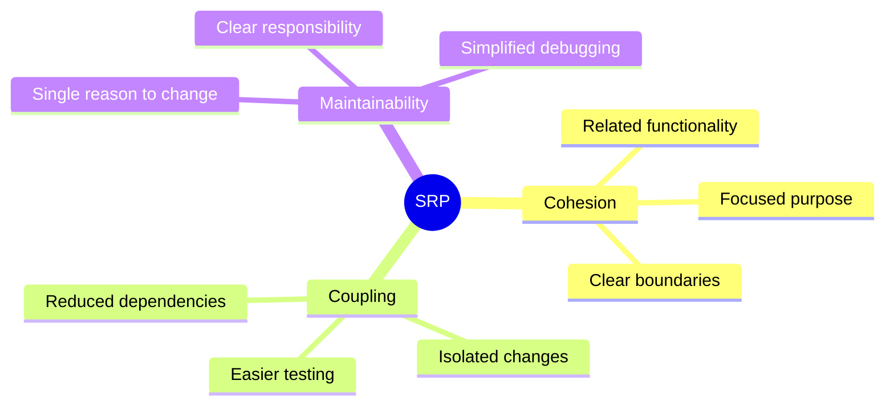
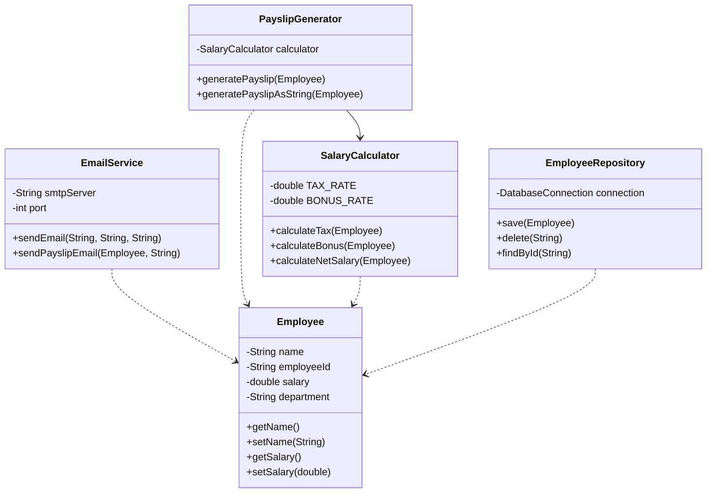

🧑‍💻 **Author:** RK ROY

# Single Responsibility Principle (SRP)

## 🎯 Definition

> "A class should have only one reason to change."
>
> _- Robert C. Martin_

The Single Responsibility Principle states that every class should have **responsibility over a single part of the functionality** provided by the software, and that responsibility should be **entirely encapsulated** by the class.

## 🤔 What Does "Single Responsibility" Mean?

A class has a single responsibility if it has **only one reason to change**. If you can think of more than one motive for changing a class, then that class has more than one responsibility.

### Key Concepts



## ❌ SRP Violation: The "God Class"

Let's look at a classic example that violates SRP:

<CodeTabs :languages="[
  { name: 'C++', slot: 'cpp' },
  { name: 'Java', slot: 'java' }
]">

<template #java>

```java
// ❌ VIOLATION: This class has multiple responsibilities
public class Employee {
    private String name;
    private String employeeId;
    private double salary;
    private String department;

    // Constructor
    public Employee(String name, String employeeId, double salary, String department) {
        this.name = name;
        this.employeeId = employeeId;
        this.salary = salary;
        this.department = department;
    }

    // Responsibility 1: Data management
    public void setName(String name) { this.name = name; }
    public String getName() { return name; }
    public void setSalary(double salary) { this.salary = salary; }
    public double getSalary() { return salary; }

    // Responsibility 2: Salary calculations
    public double calculateTax() {
        return salary * 0.25;
    }

    public double calculateBonus() {
        return salary * 0.1;
    }

    // Responsibility 3: Database operations
    public void saveToDatabase() {
        // Database connection and save logic
        System.out.println("Saving employee to database...");
    }

    public void deleteFromDatabase() {
        // Database connection and delete logic
        System.out.println("Deleting employee from database...");
    }

    // Responsibility 4: Report generation
    public void generatePayslip() {
        System.out.println("=== PAYSLIP ===");
        System.out.println("Employee: " + name);
        System.out.println("Salary: $" + salary);
        System.out.println("Tax: $" + calculateTax());
        System.out.println("Bonus: $" + calculateBonus());
    }

    // Responsibility 5: Email notifications
    public void sendEmail(String message) {
        System.out.println("Sending email to " + name + ": " + message);
    }
}
```

</template>

<template #cpp>

```cpp
#include <iostream>
#include <string>
using namespace std;

// ❌ VIOLATION: This class has multiple responsibilities
class Employee {
private:
    string name;
    string employeeId;
    double salary;
    string department;

public:
    // Constructor
    Employee(string name, string employeeId, double salary, string department) {
        this->name = name;
        this->employeeId = employeeId;
        this->salary = salary;
        this->department = department;
    }

    // Responsibility 1: Data management
    void setName(string name) { this->name = name; }
    string getName() const { return name; }

    void setSalary(double salary) { this->salary = salary; }
    double getSalary() const { return salary; }

    // Responsibility 2: Salary calculations
    double calculateTax() const {
        return salary * 0.25;
    }

    double calculateBonus() const {
        return salary * 0.1;
    }

    // Responsibility 3: Database operations
    void saveToDatabase() const {
        cout << "Saving employee to database..." << endl;
    }

    void deleteFromDatabase() const {
        cout << "Deleting employee from database..." << endl;
    }

    // Responsibility 4: Report generation
    void generatePayslip() const {
        cout << "=== PAYSLIP ===" << endl;
        cout << "Employee: " << name << endl;
        cout << "Salary: $" << salary << endl;
        cout << "Tax: $" << calculateTax() << endl;
        cout << "Bonus: $" << calculateBonus() << endl;
    }

    // Responsibility 5: Email notifications
    void sendEmail(const string& message) const {
        cout << "Sending email to " << name << ": " << message << endl;
    }
};

// Example usage
int main() {
    Employee emp("John Doe", "E123", 50000, "Engineering");
    emp.generatePayslip();
    emp.saveToDatabase();
    emp.sendEmail("Your payslip has been generated.");
    return 0;
}
```

</template>
</CodeTabs>

### Problems with This Design

1. **Multiple Reasons to Change**:
    - Tax calculation rules change
    - Database schema changes
    - Email system changes
    - Report format changes

2. **High Coupling**: Changes in one area affect others
3. **Difficult Testing**: Can't test parts in isolation
4. **Code Duplication**: Similar logic scattered across methods
5. **Violation of Single Responsibility**: Class does too many things

## ✅ SRP Solution: Separated Responsibilities

Let's refactor this into multiple classes, each with a single responsibility:

### 1. Employee Data Class

<CodeTabs :languages="[
{name : 'C++', slot : 'cpp'},
{name : 'Java', slot : 'java'}
]">

<template #java>

```java
// ✅ GOOD: Only handles employee data
public class Employee {
    private String name;
    private String employeeId;
    private double salary;
    private String department;

    public Employee(String name, String employeeId, double salary, String department) {
        this.name = name;
        this.employeeId = employeeId;
        this.salary = salary;
        this.department = department;
    }

    // Only getters and setters - data management only
    public String getName() { return name; }
    public void setName(String name) { this.name = name; }

    public String getEmployeeId() { return employeeId; }
    public void setEmployeeId(String employeeId) { this.employeeId = employeeId; }

    public double getSalary() { return salary; }
    public void setSalary(double salary) { this.salary = salary; }

    public String getDepartment() { return department; }
    public void setDepartment(String department) { this.department = department; }
}
```

</template>

<template #cpp>

```cpp
#include <string>
using namespace std;

// ✅ GOOD: Only handles employee data
class Employee {
private:
    string name;
    string employeeId;
    double salary;
    string department;

public:
    // Constructor
    Employee(const string& name, const string& employeeId, double salary, const string& department)
        : name(name), employeeId(employeeId), salary(salary), department(department) {}

    // Getters and Setters — data management only
    string getName() const { return name; }
    void setName(const string& name) { this->name = name; }

    string getEmployeeId() const { return employeeId; }
    void setEmployeeId(const string& employeeId) { this->employeeId = employeeId; }

    double getSalary() const { return salary; }
    void setSalary(double salary) { this->salary = salary; }

    string getDepartment() const { return department; }
    void setDepartment(const string& department) { this->department = department; }
};
```

</template>
</CodeTabs>

### 2. Salary Calculator Class

<CodeTabs :languages="[
{name : 'C++', slot : 'cpp'},
{name : 'Java', slot : 'java'}
]">

<template #java>

```java
// ✅ GOOD: Only handles salary calculations
public class SalaryCalculator {
    private static final double TAX_RATE = 0.25;
    private static final double BONUS_RATE = 0.1;

    public double calculateTax(Employee employee) {
        return employee.getSalary() * TAX_RATE;
    }

    public double calculateBonus(Employee employee) {
        return employee.getSalary() * BONUS_RATE;
    }

    public double calculateNetSalary(Employee employee) {
        return employee.getSalary() - calculateTax(employee) + calculateBonus(employee);
    }
}
```

</template>

<template #cpp>

```cpp
#include <iostream>
using namespace std;

class Employee; // Forward declaration (since Employee will be defined elsewhere)

class SalaryCalculator {
private:
    static constexpr double TAX_RATE = 0.25;
    static constexpr double BONUS_RATE = 0.1;

public:
    double calculateTax(const Employee& employee) const;
    double calculateBonus(const Employee& employee) const;
    double calculateNetSalary(const Employee& employee) const;
};
```

</template>

</CodeTabs>

### 3. Employee Repository Class

<CodeTabs :languages="[
{name : 'C++', slot : 'cpp'},
{name : 'Java', slot : 'java'}
]">

<template #java>

```java
// ✅ GOOD: Only handles database operations
public class EmployeeRepository {
    private DatabaseConnection connection;

    public EmployeeRepository(DatabaseConnection connection) {
        this.connection = connection;
    }

    public void save(Employee employee) {
        // Database save logic
        System.out.println("Saving employee " + employee.getName() + " to database...");
    }

    public void delete(String employeeId) {
        // Database delete logic
        System.out.println("Deleting employee " + employeeId + " from database...");
    }

    public Employee findById(String employeeId) {
        // Database query logic
        System.out.println("Finding employee " + employeeId + " in database...");
        return null; // Simplified for example
    }
}
```

</template>

<template #cpp>

```cpp
#include <iostream>
#include <string>
using namespace std;

// Mock DatabaseConnection class (for illustration)
class DatabaseConnection {
public:
    void connect() const {
        cout << "Connecting to database..." << endl;
    }

    void disconnect() const {
        cout << "Disconnecting from database..." << endl;
    }
};

// Forward declaration of Employee class
class Employee {
private:
    string name;
    string employeeId;
    double salary;
    string department;

public:
    Employee(const string& name, const string& employeeId, double salary, const string& department)
        : name(name), employeeId(employeeId), salary(salary), department(department) {}

    string getName() const { return name; }
    string getEmployeeId() const { return employeeId; }
};

// ✅ GOOD: Only handles database operations
class EmployeeRepository {
private:
    DatabaseConnection connection;

public:
    EmployeeRepository(const DatabaseConnection& conn) : connection(conn) {}

    void save(const Employee& employee) const {
        // Database save logic
        cout << "Saving employee " << employee.getName() << " to database..." << endl;
    }

    void deleteById(const string& employeeId) const {
        // Database delete logic
        cout << "Deleting employee " << employeeId << " from database..." << endl;
    }

    Employee* findById(const string& employeeId) const {
        // Database query logic
        cout << "Finding employee " << employeeId << " in database..." << endl;
        return nullptr; // Simplified for example
    }
};

// Example usage
int main() {
    DatabaseConnection db;
    EmployeeRepository repo(db);

    Employee emp("Alice", "E102", 60000, "Finance");

    repo.save(emp);
    repo.findById("E102");
    repo.deleteById("E102");

    return 0;
}
```

</template>
</CodeTabs>

### 4. Payslip Generator Class

<CodeTabs :languages="[
{name : 'C++', slot : 'cpp'},
{name : 'Java', slot : 'java'}
]">

<template #java>

```java
// ✅ GOOD: Only handles report generation
public class PayslipGenerator {
    private SalaryCalculator calculator;

    public PayslipGenerator(SalaryCalculator calculator) {
        this.calculator = calculator;
    }

    public void generatePayslip(Employee employee) {
        System.out.println("=== PAYSLIP ===");
        System.out.println("Employee: " + employee.getName());
        System.out.println("ID: " + employee.getEmployeeId());
        System.out.println("Department: " + employee.getDepartment());
        System.out.println("Gross Salary: $" + employee.getSalary());
        System.out.println("Tax: $" + calculator.calculateTax(employee));
        System.out.println("Bonus: $" + calculator.calculateBonus(employee));
        System.out.println("Net Salary: $" + calculator.calculateNetSalary(employee));
        System.out.println("================");
    }

    public String generatePayslipAsString(Employee employee) {
        StringBuilder sb = new StringBuilder();
        sb.append("Payslip for: ").append(employee.getName()).append("\n");
        sb.append("Net Salary: $").append(calculator.calculateNetSalary(employee));
        return sb.toString();
    }
}
```

</template>
<template #cpp>

```cpp
#include <iostream>
#include <string>
#include <sstream>
using namespace std;

// Forward declarations
class Employee;
class SalaryCalculator;

class PayslipGenerator {
private:
    const SalaryCalculator& calculator;

public:
    PayslipGenerator(const SalaryCalculator& calc) : calculator(calc) {}

    void generatePayslip(const Employee& employee) const {
        cout << "=== PAYSLIP ===" << endl;
        cout << "Employee: " << employee.getName() << endl;
        cout << "ID: " << employee.getEmployeeId() << endl;
        cout << "Department: " << employee.getDepartment() << endl;
        cout << "Gross Salary: $" << employee.getSalary() << endl;
        cout << "Tax: $" << calculator.calculateTax(employee) << endl;
        cout << "Bonus: $" << calculator.calculateBonus(employee) << endl;
        cout << "Net Salary: $" << calculator.calculateNetSalary(employee) << endl;
        cout << "================" << endl;
    }

    string generatePayslipAsString(const Employee& employee) const {
        stringstream ss;
        ss << "Payslip for: " << employee.getName() << "\n";
        ss << "Net Salary: $" << calculator.calculateNetSalary(employee);
        return ss.str();
    }
};
```

</template>
</CodeTabs>

### 5. Email Service Class

<CodeTabs :languages="[
{name : 'C++', slot : 'cpp'},
{name : 'Java', slot : 'java'}
]">

<template #java>

```java
// ✅ GOOD: Only handles email operations
public class EmailService {
    private String smtpServer;
    private int port;

    public EmailService(String smtpServer, int port) {
        this.smtpServer = smtpServer;
        this.port = port;
    }

    public void sendEmail(String recipientEmail, String subject, String message) {
        // Email sending logic
        System.out.println("Sending email to: " + recipientEmail);
        System.out.println("Subject: " + subject);
        System.out.println("Message: " + message);
    }

    public void sendPayslipEmail(Employee employee, String payslipContent) {
        String subject = "Payslip for " + employee.getName();
        sendEmail(employee.getName() + "@company.com", subject, payslipContent);
    }
}
```

</template>

<template #cpp>

```cpp
#include <iostream>
#include <string>
using namespace std;

// Forward declaration
class Employee;

class EmailService {
private:
    string smtpServer;
    int port;

public:
    EmailService(const string& smtpServer, int port)
        : smtpServer(smtpServer), port(port) {}

    void sendEmail(const string& recipientEmail, const string& subject, const string& message) const {
        // Email sending logic
        cout << "Sending email to: " << recipientEmail << endl;
        cout << "Subject: " << subject << endl;
        cout << "Message: " << message << endl;
    }

    void sendPayslipEmail(const Employee& employee, const string& payslipContent) const {
        string subject = "Payslip for " + employee.getName();
        sendEmail(employee.getName() + "@company.com", subject, payslipContent);
    }
};
```

</template>
</CodeTabs>

## 🏗️ Class Diagram After SRP



## 🎯 Using the Refactored Classes

<CodeTabs :languages="[
{name : 'C++', slot : 'cpp'},
{name : 'Java', slot : 'java'}
]">

<template #java>

```java
public class EmployeeManagementSystem {
    public static void main(String[] args) {
        // Create dependencies
        SalaryCalculator calculator = new SalaryCalculator();
        EmployeeRepository repository = new EmployeeRepository(new DatabaseConnection());
        PayslipGenerator payslipGenerator = new PayslipGenerator(calculator);
        EmailService emailService = new EmailService("smtp.company.com", 587);

        // Create employee
        Employee employee = new Employee("John Doe", "EMP001", 50000, "Engineering");

        // Save to database
        repository.save(employee);

        // Generate payslip
        payslipGenerator.generatePayslip(employee);
        String payslipContent = payslipGenerator.generatePayslipAsString(employee);

        // Send payslip via email
        emailService.sendPayslipEmail(employee, payslipContent);
    }
}
```

</template>
<template #cpp>

```cpp
#include <iostream>
#include <string>
using namespace std;

// Forward declarations of all used classes
class DatabaseConnection;
class Employee;
class SalaryCalculator;
class EmployeeRepository;
class PayslipGenerator;
class EmailService;

class EmployeeManagementSystem {
public:
    static void main() {
        // Create dependencies
        SalaryCalculator calculator;
        EmployeeRepository repository(DatabaseConnection());
        PayslipGenerator payslipGenerator(calculator);
        EmailService emailService("smtp.company.com", 587);

        // Create employee
        Employee employee("John Doe", "EMP001", 50000, "Engineering");

        // Save to database
        repository.save(employee);

        // Generate payslip
        payslipGenerator.generatePayslip(employee);
        string payslipContent = payslipGenerator.generatePayslipAsString(employee);

        // Send payslip via email
        emailService.sendPayslipEmail(employee, payslipContent);
    }
};

// Entry point
int main() {
    EmployeeManagementSystem::main();
    return 0;
}
```

</template>
</CodeTabs>

## 🎨 More SRP Examples

### Example 1: User Authentication

#### ❌ Violation

<CodeTabs :languages="[
{name : 'C++', slot : 'cpp'},
{name : 'Java', slot : 'java'}
]">

<template #java>

```java
public class UserManager {
    public boolean validateUser(String username, String password) { ... }
    public void sendPasswordResetEmail(String email) { ... }
    public void logUserActivity(String username, String activity) { ... }
    public void saveUserToDatabase(User user) { ... }
    public User getUserFromDatabase(String username) { ... }
}
```

</template>

<template #cpp>

```cpp
#include <iostream>
#include <string>
using namespace std;

class User {};

class UserManager {
public:
    bool validateUser(const string& username, const string& password) { /* ... */ return true; }
    void sendPasswordResetEmail(const string& email) { /* ... */ }
    void logUserActivity(const string& username, const string& activity) { /* ... */ }
    void saveUserToDatabase(const User& user) { /* ... */ }
    User getUserFromDatabase(const string& username) { /* ... */ return User(); }
};
```

</template>
</CodeTabs>

#### ✅ Solution

<CodeTabs :languages="[
{name : 'C++', slot : 'cpp'},
{name : 'Java', slot : 'java'}
]">

<template #java>

```java
public class AuthenticationService {
    public boolean validateUser(String username, String password) { ... }
}

public class EmailService {
    public void sendPasswordResetEmail(String email) { ... }
}

public class ActivityLogger {
    public void logUserActivity(String username, String activity) { ... }
}

public class UserRepository {
    public void saveUser(User user) { ... }
    public User getUser(String username) { ... }
}
```

</template>

<template #cpp>

```cpp
#include <iostream>
#include <string>
using namespace std;

class User {};

class AuthenticationService {
public:
    bool validateUser(const string& username, const string& password) {
        cout << "Validating user: " << username << endl;
        return true;
    }
};

class EmailService {
public:
    void sendPasswordResetEmail(const string& email) {
        cout << "Sending password reset email to: " << email << endl;
    }
};

class ActivityLogger {
public:
    void logUserActivity(const string& username, const string& activity) {
        cout << "User " << username << " performed: " << activity << endl;
    }
};

class UserRepository {
public:
    void saveUser(const User& user) { cout << "User saved to DB\n"; }
    User getUser(const string& username) { cout << "Getting user from DB\n"; return User(); }
};
```

</template>
</CodeTabs>

### Example 2: Order Processing

#### ❌ Violation

<CodeTabs :languages="[
{name : 'C++', slot : 'cpp'},
{name : 'Java', slot : 'java'}
]">

<template #java>

```java
public class Order {
    private List<OrderItem> items;

    public void addItem(OrderItem item) { ... }
    public double calculateTotal() { ... }
    public double calculateTax() { ... }
    public void saveToDatabase() { ... }
    public void sendConfirmationEmail() { ... }
    public void updateInventory() { ... }
}
```

</template>

<template #cpp>

```cpp
#include <iostream>
#include <vector>
using namespace std;

class OrderItem {};

class Order {
    vector<OrderItem> items;
public:
    void addItem(const OrderItem& item) { /* ... */ }
    double calculateTotal() { /* ... */ return 0.0; }
    double calculateTax() { /* ... */ return 0.0; }
    void saveToDatabase() { /* ... */ }
    void sendConfirmationEmail() { /* ... */ }
    void updateInventory() { /* ... */ }
};
```

</template>
</CodeTabs>

#### ✅ Solution

<CodeTabs :languages="[
{name : 'C++', slot : 'cpp'},
{name : 'Java', slot : 'java'}
]">

<template #java>

```java
public class Order {
    private List<OrderItem> items;
    public void addItem(OrderItem item) { ... }
    // Only order data management
}

public class OrderCalculator {
    public double calculateTotal(Order order) { ... }
    public double calculateTax(Order order) { ... }
}

public class OrderRepository {
    public void save(Order order) { ... }
}

public class OrderNotificationService {
    public void sendConfirmationEmail(Order order) { ... }
}

public class InventoryService {
    public void updateInventory(Order order) { ... }
}
```

</template>

<template #cpp>

```cpp
#include <iostream>
#include <vector>
using namespace std;

class OrderItem {};
class Order {
    vector<OrderItem> items;
public:
    void addItem(const OrderItem& item) { cout << "Item added\n"; }
};

class OrderCalculator {
public:
    double calculateTotal(const Order& order) { cout << "Calculating total\n"; return 100.0; }
    double calculateTax(const Order& order) { cout << "Calculating tax\n"; return 18.0; }
};

class OrderRepository {
public:
    void save(const Order& order) { cout << "Order saved to database\n"; }
};

class OrderNotificationService {
public:
    void sendConfirmationEmail(const Order& order) { cout << "Email sent to customer\n"; }
};

class InventoryService {
public:
    void updateInventory(const Order& order) { cout << "Inventory updated\n"; }
};
```

</template>
</CodeTabs>

## 🔍 How to Identify SRP Violations

### Questions to Ask

1. **Can I describe the class responsibility in a single sentence without using "and" or "or"?**
2. **How many reasons can I think of for changing this class?**
3. **Does this class have methods that operate on different sets of data?**
4. **Would different stakeholders want to change different parts of this class?**

### Warning Signs

- ❌ Class names with "Manager", "Handler", "Controller", "Util"
- ❌ Methods that don't use instance variables
- ❌ Large classes (> 200-300 lines)
- ❌ Many import statements
- ❌ Methods that belong to different conceptual groups

## 🏆 Benefits of Following SRP

### 1. **Easier Maintenance**

```java
// If tax rules change, only SalaryCalculator needs to change
public class SalaryCalculator {
    public double calculateTax(Employee employee) {
        // Easy to modify tax logic without affecting other classes
        return employee.getSalary() * getCurrentTaxRate();
    }
}
```

### 2. **Better Testability**

```java
@Test
public void testTaxCalculation() {
    SalaryCalculator calculator = new SalaryCalculator();
    Employee employee = new Employee("John", "001", 50000, "IT");

    double tax = calculator.calculateTax(employee);

    assertEquals(12500.0, tax, 0.01);
}
```

### 3. **Improved Reusability**

```java
// EmailService can be reused for different purposes
EmailService emailService = new EmailService("smtp.server.com", 587);
emailService.sendEmail("user@example.com", "Welcome", "Welcome message");
emailService.sendEmail("admin@example.com", "Alert", "System alert");
```

### 4. **Reduced Coupling**

- Changes in one class don't affect others
- Classes can be developed and tested independently
- Easier to understand and debug

## 🎯 Common Misconceptions

### ❌ "One Method Per Class"

SRP doesn't mean one method per class. A class can have multiple methods if they all serve the same responsibility.

```java
// ✅ GOOD: Multiple methods, single responsibility (string manipulation)
public class StringFormatter {
    public String toUpperCase(String input) { ... }
    public String toLowerCase(String input) { ... }
    public String capitalize(String input) { ... }
    public String removeSpaces(String input) { ... }
}
```

### ❌ "Avoid All Dependencies"

SRP doesn't mean classes can't depend on each other. Dependencies are fine if they support the single responsibility.

```java
// ✅ GOOD: OrderService depends on other services but has single responsibility
public class OrderService {
    private PaymentProcessor paymentProcessor;
    private InventoryService inventoryService;

    public void processOrder(Order order) {
        // Single responsibility: orchestrating order processing
    }
}
```

## 🛠️ Refactoring to SRP

### Step-by-Step Process

1. **Identify Responsibilities**: List all things the class does
2. **Group Related Methods**: Find methods that work together
3. **Extract Classes**: Create new classes for each responsibility
4. **Define Interfaces**: Create contracts between classes
5. **Update Dependencies**: Inject dependencies where needed
6. **Test**: Ensure functionality is preserved

### Example Refactoring Process

<CodeTabs :languages="[
{name : 'C++', slot : 'cpp'},
{name : 'Java', slot : 'java'}
]">

<template #java>

```java
// Before: Mixed responsibilities
public class BookService {
    public void addBook(Book book) { ... }           // Data management
    public List<Book> searchBooks(String query) { ... } // Search logic
    public void sendNotification(String message) { ... } // Communication
    public void generateReport() { ... }              // Reporting
}

// After: Separated responsibilities
public class BookRepository {
    public void save(Book book) { ... }
    public List<Book> findByQuery(String query) { ... }
}

public class NotificationService {
    public void sendNotification(String message) { ... }
}

public class ReportGenerator {
    public void generateBookReport() { ... }
}

public class BookService {
    private BookRepository repository;
    private NotificationService notificationService;

    // Orchestrates operations - single responsibility
    public void addBook(Book book) {
        repository.save(book);
        notificationService.sendNotification("Book added: " + book.getTitle());
    }
}
```

</template>

<template #cpp>

```cpp
#include <iostream>
#include <string>
#include <vector>
using namespace std;

class Book {
    string title;
public:
    Book(string t) : title(t) {}
    string getTitle() const { return title; }
};

class BookRepository {
public:
    void save(const Book& book) { cout << "Book saved: " << book.getTitle() << endl; }
    vector<Book> findByQuery(const string& query) {
        cout << "Searching for books: " << query << endl;
        return {};
    }
};

class NotificationService {
public:
    void sendNotification(const string& message) {
        cout << "Notification: " << message << endl;
    }
};

class ReportGenerator {
public:
    void generateBookReport() { cout << "Generating book report\n"; }
};

class BookService {
    BookRepository repository;
    NotificationService notificationService;
public:
    void addBook(const Book& book) {
        repository.save(book);
        notificationService.sendNotification("Book added: " + book.getTitle());
    }
};
```

</template>
</CodeTabs>

## 🎓 Practice Exercise

### Exercise: Refactor the Violation

Here's a class that violates SRP. Can you refactor it?

<CodeTabs :languages="[
{name : 'C++', slot : 'cpp'},
{name : 'Java', slot : 'java'}
]">

<template #java>

```java
public class StudentManager {
    private List<Student> students = new ArrayList<>();

    // Student management
    public void addStudent(Student student) { ... }
    public void removeStudent(String studentId) { ... }
    public Student findStudent(String studentId) { ... }

    // Grade calculation
    public double calculateGPA(String studentId) { ... }
    public String getGradeLevel(double gpa) { ... }

    // File operations
    public void saveToFile(String filename) { ... }
    public void loadFromFile(String filename) { ... }

    // Email notifications
    public void sendGradeReport(String studentId) { ... }
    public void sendWelcomeEmail(Student student) { ... }

    // Report generation
    public void generateClassReport() { ... }
    public void generateStudentTranscript(String studentId) { ... }
}
```

</template>
<template #cpp>

```cpp
#include <iostream>
#include <vector>
#include <string>
using namespace std;

class Student {};

class StudentManager {
    vector<Student> students;
public:
    void addStudent(const Student& student) { /* ... */ }
    void removeStudent(const string& id) { /* ... */ }
    Student findStudent(const string& id) { /* ... */ return Student(); }

    double calculateGPA(const string& id) { /* ... */ return 0.0; }
    string getGradeLevel(double gpa) { /* ... */ return "A"; }

    void saveToFile(const string& filename) { /* ... */ }
    void loadFromFile(const string& filename) { /* ... */ }

    void sendGradeReport(const string& id) { /* ... */ }
    void sendWelcomeEmail(const Student& student) { /* ... */ }

    void generateClassReport() { /* ... */ }
    void generateStudentTranscript(const string& id) { /* ... */ }
};
```

</template>
</CodeTabs>

### Solution Approach

1. Create `StudentRepository` for data management
2. Create `GradeCalculator` for grade-related calculations
3. Create `FileManager` for file operations
4. Create `EmailService` for notifications
5. Create `ReportGenerator` for reports
6. Create `StudentService` to orchestrate operations

## 📚 Summary

The Single Responsibility Principle is about creating **focused, cohesive classes** that have **one clear purpose**. By following SRP:

- ✅ **Easier to maintain**: Changes are localized
- ✅ **Better testability**: Isolated testing of functionality
- ✅ **Improved reusability**: Focused classes can be reused
- ✅ **Reduced coupling**: Classes are less dependent on each other
- ✅ **Clearer code**: Each class has a clear, single purpose

Remember: **A class should have only one reason to change!**

---
